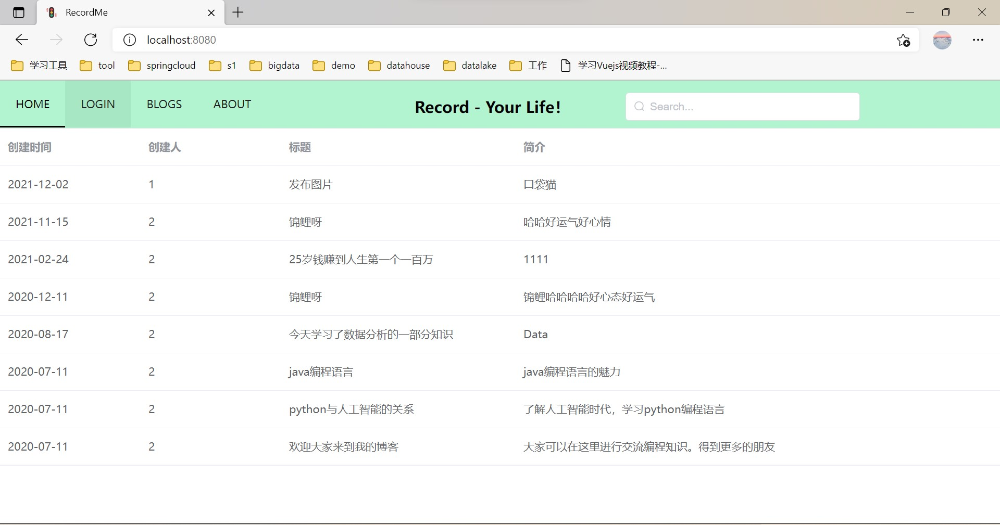
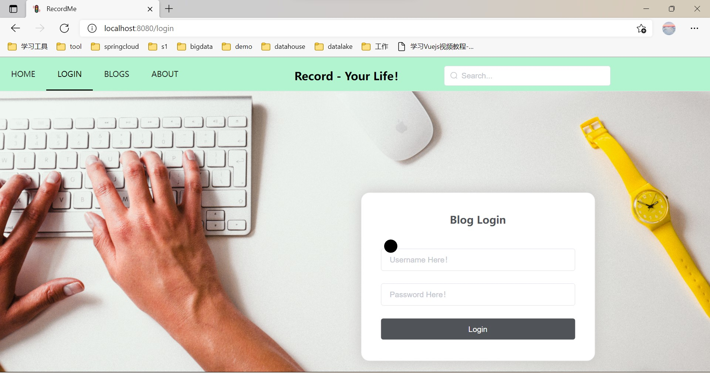
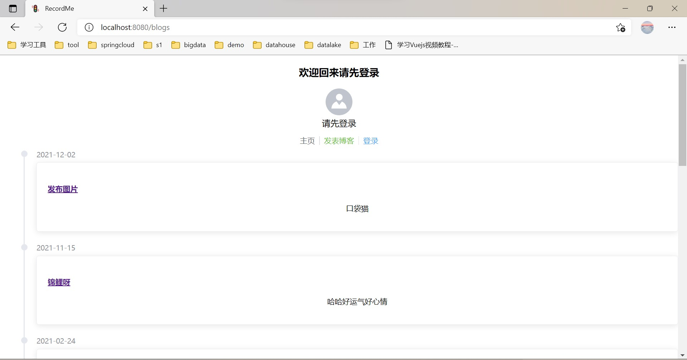

# BLOG

#### 介绍
一个BLOG项目，不是特别难的项目，使用的技术栈算是比较目前企业中比较新的，拿下来练练手还是可以的。

#### 软件架构
软件架构说明

前端：
- Vue
- Element-UI
- Axios

服务端：
- SpringBoot
- Shiro
- Redis
- MySQL
- MyBatis-Plus

#### 安装教程

1.  项目clone到本地后，使用vscode打开前端项目RecordMe，终端运行npm run serve命令
2.  使用IDEA或Eclipse打开back，将里面的MySQL密码添加为自己的密码，将本地的Redis启动起来，之后运行项目启动类即可。
3.  浏览器中访问localhost:8080即可访问到项目页面。

#### 项目展示

#### 参与贡献

1.  Fork 本仓库
2.  新建 Feat_xxx 分支
3.  提交代码
4.  新建 Pull Request
